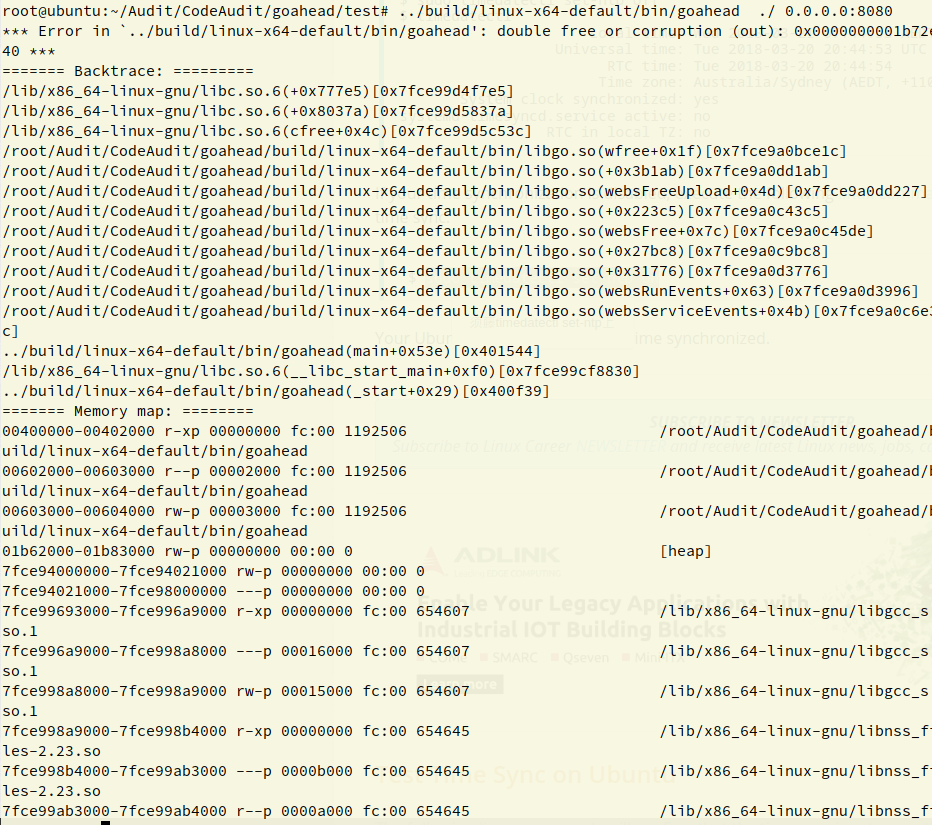
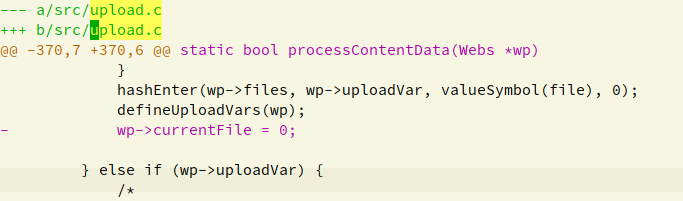

## CVE-2019-5096 Use After Free Dos Exploit
	python TriggerDOS.py ip	



### 漏洞分析
[https://github.com/embedthis/goahead.git] GoAhead githublink  


#### git diff the patch  




#### 关键代码分析 

在代码中定位到upload.c:370,可以看到在
```c
	wp->currentFile=0
```

前执行了  
```c
typedef struct WebsUpload {
    char    *filename;              /**< Local (temp) name of the file */
    char    *clientFilename;        /**< Client side name of the file */
    char    *contentType;           /**< Content type */
    ssize   size;                   /**< Uploaded file size */
} WebsUpload;
...

typedef struct Webs {
...
    WebsUpload      *currentFile;
...
}Webs;
...
processContentData(Webs *wp){
...
	file = wp->currentFile;
	...
	hashEnter(wp->files, wp->uploadVar, valueSymbol(file), 0);
	defineUploadVars(wp);
	wp->currentFile=0;
	...
}
```

其中hashEnter函数是往hash表里添加一个元素，这里造成了 wp-currentFile 的多次引用。  wp->files(hash table)里的WebsUpload结构将在 http 会话结束( Webs 生命周期结束)调用 termWebs 时 free 掉  

```c
static void termWebs(Webs *wp, int reuse)
{
...
#if ME_GOAHEAD_UPLOAD
    if (wp->files >= 0) {
        websFreeUpload(wp);//遍历hashtable 取出WebsUpload结构体free掉。
    }
#endif
}

```

接下来看另外一个free 的点:  
```c
...
processUploadHeader(Webs *wp, char *line)
{
	while (key && stok(key, ";\r\n", &nextPair)) {// 这是以 ; 为分割符解析 upload 头部
		...
		else if (scaselesscmp(key, "filename") == 0) {
		...
		freeUploadFile(wp->currentFile);
		file = wp->currentFile = walloc(sizeof(WebsUpload));
		...		
        }
	}
}
```

发现如果  upload 头部有 filename 字段则 free 掉 wp->currentFile, 接着 walloc 一个 WebsUpload 。  
由于 sizeof(WebsUpload) 落在 global_max_fast 大小以内，堆快将按照先进后出分配，则刚刚 free 的
堆快马上又被分配，并且在之后的 processContentData 函数时又会加入 hash 表。此时 hash 表内已有该 chunk两次引用，
termWebs 时发生 double free 并 abort 。  


#### 触发漏洞

一次请求添加两个 upload 头部:    
在 processContentData 函数之后再次进入 processUploadHeader 函数。即如下顺序调用:  

websProcessUploadData (循环) #上传状态机，每次循环确定一个状态 
	->initUpload()  
 	->processContentBoundary()  
	->processUploadHeader()  
	->processContentData()  
	->processContentBoundary()  
	->processUploadHeader()  
	->processContentData()  
	->return;  

#### 代码执行可能性

...
