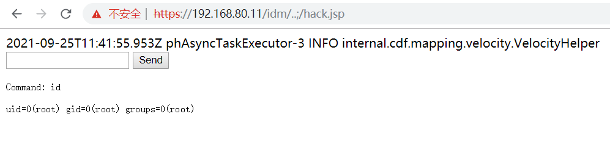
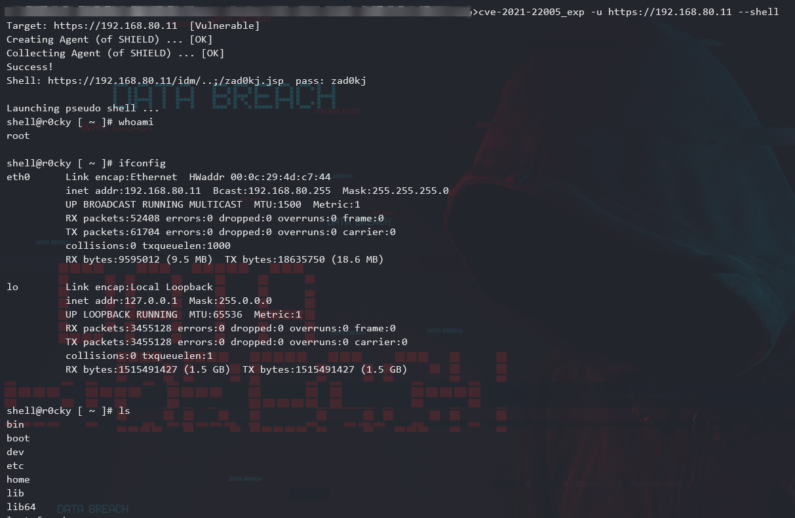

# CVE-2021-22005 - VMWare vCenter Server File Upload to RCE
#### Analyze




#### Usage

```
-------------------------------------------------------------
[*] CVE-2021-22005 - VMWare vCenter Server File Upload to RCE
[*] Github: https://github.com/r0ckysec
[*] Twitter: https://twitter.com/r0cky6861636b
[*] Author: r0cky
-------------------------------------------------------------


Usage: ./cve-2021-22005_exp -u <http://target>

Optional Arguments:
  -h help         Show This Help Message And Exit
  -u url          Will Send Payload To Target URL
  -s shell        One-click GetShell
  -p proxy        Specific Request Proxy
```


##### GetShell

